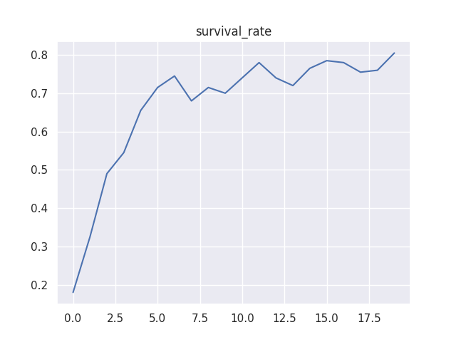
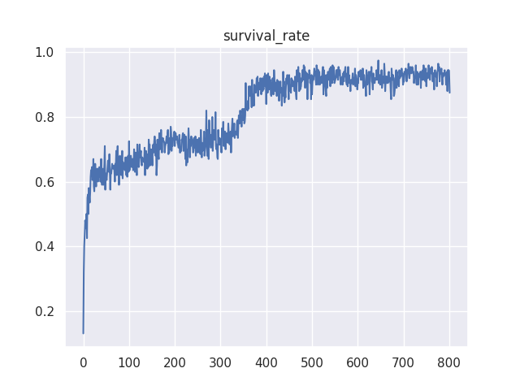

# Darwin, _In Silico_: Experiments in Digital Evolution

## Introduction

This repo was made for the students of the King's Certificate program to serve as a base for creating custom evolution experiments. The following is the project brief:

**Background: Darwin and Turing**

The stunning complexity of the biological world exists due to evolution by natural selection. So it's not surprising that early computer scientists, such as Alan Turing, turned to these principles when they sought to develop complex computer systems. Although the theory of natural selection was developed from Charles Darwin's observations of animals and fossils, the core ideas of variation, selection, and reproduction are independent of the biological substrate. In other words, evolution is not confined to only taking place *in vivo* (in life), but can also take place *in silico* (in machines).

Since Turing, computer scientists have developed the ideas in the fields of Evolutionary Computation (EC) and Genetic Algorithms (GAs). GAs involve creating "genetic representations" of computer programs that are evolved to perform specific tasks of interest. More successful individuals in a population survive to the next generation and have offspring through mutations and genetic crossover. For example this method could be applied if you want a virtual creature in a physics simulation that can swim towards a goal. This was the subject of Karl Sims' famous ["Evolved Virtual Creatures"](https://www.youtube.com/watch?v=JBgG_VSP7f8&ab_channel=MediaArtTube) project from 1994 (you can find the film on YouTube).

In their article, ["The Surprising Creativity of Digital Evolution: A Collection of Anecdotes from the Evolutionary Computation and Artificial Life (ALIFE) Research Communities"](https://direct.mit.edu/artl/article/26/2/274/93255/The-Surprising-Creativity-of-Digital-Evolution-A), authors Joel Lehman and colleagues survey scientists working with digital evolution. They catalogue situations in which the scientists' "evolving algorithms and organisms have creatively subverted their expectations or intentions, exposed unrecognized bugs in their code, produced unexpectedly adaptations, or engaged in behaviours and outcomes, uncannily convergent with ones found in nature". My favourite example is Thompson's experiment for evolving real electronic circuits, only to produce an "impossible" circuit with disconnected elements that where somehow crucial to the operation of the circuit (see the paper for how this happened!).

**Problem Statement**

In this project students will be tasked with creating a Digital Evolution simulation of their choosing. I have created a simple [codebase](https://github.com/DylanCope/kc-evo-sim) that the students can start from if they like, but they are free to take a different approach. My codebase is inspired by David Miller's evolution simulation that can be seen in his YouTube video ["I programmed some creatures. They Evolved."](https://www.youtube.com/watch?v=N3tRFayqVtk&ab_channel=davidrandallmiller).

There are many possible questions that the students could explore with their simulations, but here are few starting points:
1. What are the effects of different mutation and genetic crossover schemes?
2. What are the effects of "mate selection"? In the simulation provided, surviving creatures are randomly paired with one another to produce offspring. This is of course very unrealistic as real animals select one another based on desirability. Indeed, this fundamental part of Darwin's theories called evolution by sexual selection. The students could investigate the effects of this by encoding genes that define desirability criteria in mates.
3. Can altruism evolve? Scientists have long been interest in the evolution of cooperative behaviours and there are many different kinds of experiments the students could do, such as investigating "Green Beard-Effects".
4. Can we distinguish between "adaptive" and "neutral" evolution in our simulations? Adaptive changes in traits are ones that increase fitness. Neutral changes are ones that have no effect on fitness but nonetheless become prevalent by chance and by "riding alongside" adaptive changes.

## About the Simulation

### A Simple Example

As mentioned previously, this simulation is heavily inspired by [David Miller's simulation](https://www.youtube.com/watch?v=N3tRFayqVtk&ab_channel=davidrandallmiller).
The basic idea is that there is a grid world in which these "creatures" must fulfill certain selection criteria in order to survive. In the example below, they must reach the green squares in the environment. The creatures are controlled by a small feed-forward neural network (see [this helpful YouTube series](https://www.youtube.com/watch?v=bxe2T-V8XRs&ab_channel=WelchLabs) for a primer on neural networks).

The neural network takes in some information about whether or not adjacent cells are occupied (indicated with a 1 or a 0) and the position of the creature in the world (between 0 and 1). The network then outputs a number for each action it could take, i.e. go up, down, left, or right, and the creature picks the action with the highest value.

The initial population of creatures is randomly given weights in its neural networks, but only those that happened to be born in the green zone, or those who tended to move right, survived. Over the generations, the individuals that were more likely to make it to the green zone pass on their genes. You can see that by generation 15 some of the individuals even seem to move up or down if they detect that they can't move right, and therefore manage to slot themselves into the green area even when it is quite full.

<p align="center">

</p>

As the simulation runs, it produces data, logs, and plots metrics such as the survival rate:

<p align="center">

</p>

### A More Interesting Example

We can make this example more interesting by introducing a simple barrier in the path to the survival region. In the below videos, we see that as before the creatures start out moving randomly in all directions. By generation 20 they are almost all moving to the right, and about 60% are surviving. By generation 100 we see that the genetic diversity in the population has started to noticibly narrow, as made visible by the colours of the creatures. 200 generations later and we see that a bit of progress has been made. They no longer only move right, but also react to one another and move up or down accordingly. The result is the smoother "mound-like" pile on the barrier.

On generation 580, we see that evolution has essentially solved the task, with 91.5% surviving. The agents are now better at coordinating their actions while on the mound, and while in the survival zone. All but one managed to get off the barrier, and only a handful more were unable to make it to the survival zone.

<p align="center">

</p>

If we turn to the survival rate graph we can see these transitions. Generation 20 sits just about where the sharp increase levels off to a gradual climb in performance. Then, after generation 300 we see another sharp climb, presumbaly as the strategy for getting off the barrier was found and refined.

<p align="center">

</p>

## Installation

Make sure you have Python 3.10+ installed, clone the repository onto your machine, and then run `pip install -r requirements.txt` in the commandline in the root directory.

## About the Codebase

As mentioned previously, this codebase has been designed to be minimal yet customisable. The default entry point to the code is the `run.py` file at the root of the repository. This is executed with the command `python run.py <experiment_name>`, where `<experiment_name>` is the name of a `YAML` file located in the `experiments/config` folder. For example, the following command will run the example experiment:
```sh
python run.py right_side_survive_v1
```

**Config files.** Configuration files are used to specify the parameters of a run. An example file might look like:

```yaml
inherits_from: 'my_other_experiment_v1'
n_generations: 100
world_steps_per_generation: 100
world_width: 50
world_height: 50
pop_size: 300
hidden_layer_dims: [5, 5]
mutation_rate: 0.05
repop_config:
  method: 'random_crossover'
selection_config:
  method: 'one_side_survive'
  survival_side: 'left'
callbacks:
  render_video:
    video_frequency: 5
    fps: 5
  logger:
    plot_frequency: 5
```

The key thing to understand is that the config files can inherit from one another, and any values not specified will be filled in automatically by the `default_config.yaml` file. You can create new config YAML files in the `experiments/config` directory to play with different parameter configurations.

## Custom Functionality

There are four main forms of customisation: creating custom *selection functions*, *repopulation functions*, *world generators*, or *callbacks*. 

### Selection and Repopulation

Selection and repopulation are fundamental parts of evolutionary computation, as such there are many different approaches that we could implement.

In this project, selection functions will be called at the end of each generation and the user must define a `selection_fn(self, world: World, organism: Organism) -> bool` method to decide if an organism survives to the next generation. For a custom repopulation function the user decides how the next generation is built by overriding a `create_new_organism(self, world: World) -> Organism`, which creates a new organism to be added to population and replace those that were not selected. The default 'random_crossover' repopulation method uses the `crossover` method on the `Genome` class, but a custom `create_new_organism` could employ any creative or bizzare strategy!

Addtionally, the user can override the `select` method for a selection function, or the `repopulate` method for repopulation function to have more control.

Creating a new selection function is done by defining a subclass of the `SelectionFn` class:
```py
from evo.selection.selection_fn import SelectionFn
from evo.util.registry import register_selection_fn
from evo.organism import Organism
from evo.world import World

@register_selection_fn("custom_selection_fn")
class MyCustomSelectionFn(SelectionFn):

    def selection_fn(self, world: World, organism: Organism) -> bool:
        # your code here
```

The process for setting up a repop function is almost identical. For examples of how this is done, check out the `evo.selection.region_based_selection` and `evo.repop.random_crossover` files.

Its important to note the registration of the selection function using the `register_selection_fn` decorator. This is an important part that links the configuration files to the class. When you specify the "method" in the selection config (see the example YAML above), it will look to find a class that has been registered with that name.

**Note:** If you are new to Python and coming from a compiled language such as Java, you may run into problems if you custom class is never declared. In Python you have to make sure that the lines of code that define your class are actually called, and the custom function is then properly registered. You will notice that this is handled in the `__init__.py` files in the `evo` package. If you want to avoid this problem all together, you can manually register the class in your own script.

```py
# custom_selection_fn.py
...

class MyCustomSelectionFn(SelectionFn):

    def selection_fn(self, world: World, organism: Organism) -> bool:
        # your code here
```

And in your run script:
```py
# my_run_script.py
...
from custom_selection_fn import MyCustomSelectionFn
from evo.util.registry import register_selection_fn_class

...
# somewhere before you make your experiment
register_selection_fn_class('custom_selection_fn', MyCustomSelectionFn)
...
```

However you register the selection function, to use the custom selection function, your config will need to look something like:

```yaml
...
selection_config:
  method: 'custom_selection_fn'
  my_param: 5
...
```

Notice that we can put custom parameters into the config, which are accessible from the code. We also have access to global configuration values, such as the world width:
```py
    def selection_fn(self, world: World, organism: Organism) -> bool:
        my_param = self.config.get('my_param')
        world_width = self.global_config.get('world_width')
```

### World Generators

As we saw in the section showcasing the simulation with the barrier, a small change to the environment can have a big difference and introduce subtle complexities. Creating a custom `WorldGenerator` class looks very similar to selection or repop functions:
```py
from evo.world import World
from evo.world_gen.world_generator import WorldGenerator
from evo.util.registry import register_world_gen


@register_world_gen('my_world_generator')
class MyWorldGenerator(WorldGenerator):

    def generate(self, world: World):
        # your code here
```

And again, similarly, the configuration file to use this generator in an experiment would look like:
```yaml
world_gen:
  method: 'my_world_generator'
  my_param: 10
```
In the `generate` method, you can populate the world using the `world.set_cell(x: int, y: int, value)` method. Note that by default, anything that is not an `Organism` will be rendered as a dark grey filled square. Custom renderers can be writter with custom callbacks, as demonstrated in the next section.

### Simulation Callbacks

Simulation callbacks are called during execution to perform useful utilities such as measuring metrics, rendering video frames, or logging data. You can create a custom callback by inheriting from the `Callback` class and implementing any of the methods.
```py
from evo.util.registry import register_callback
from evo.util.callback import Callback

@register_callback('my_callback')
class MyCallback(Callback):
  
    def on_step_finish(self, generation: int, world: World) -> dict:
        # your code here
        return log_dict  # dictionary of things to be logged

    def on_generation_finish(self,
                             generation: int,
                             generation_logs: dict,
                             world: World) -> None:
        # your code here

    def on_interrupt(self, world: World) -> None:
        # your code here
```

Then to use the callback in an experiment, add it to the list of callbacks in the configuration:
```yaml
callbacks:
  - my_callback:
    my_param: 10
```

For examples of callbacks see the `evo.util.render.RenderVideoCallback` or the `evo.util.logger.LoggerCallback` classes.
